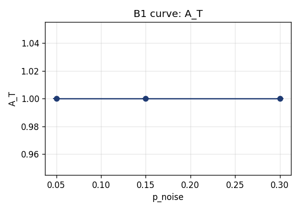
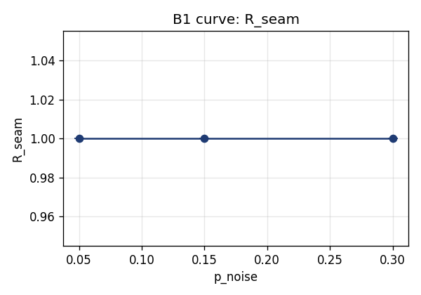
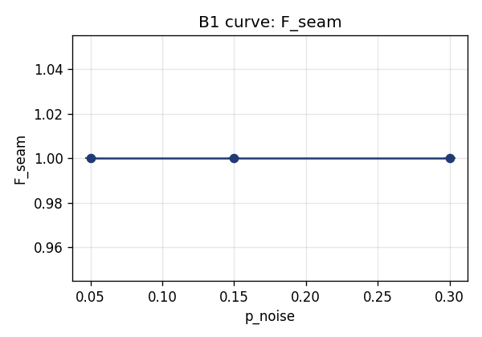
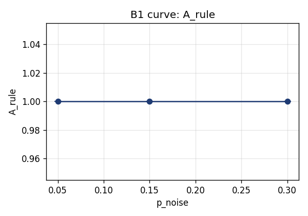
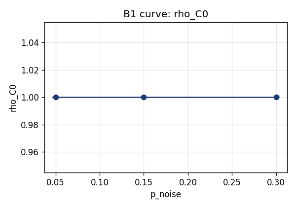
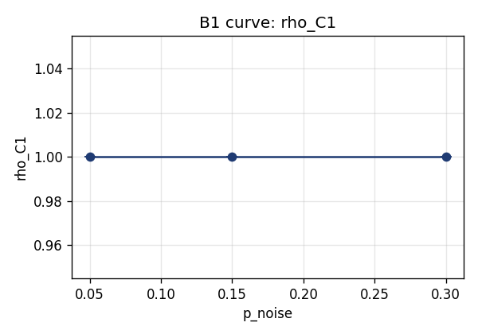
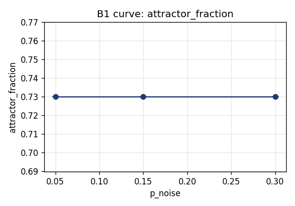
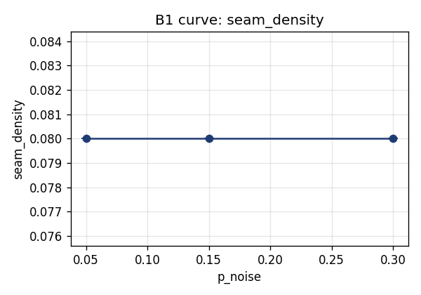
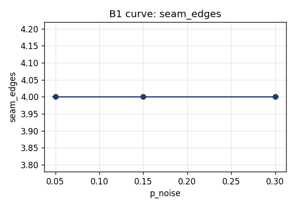
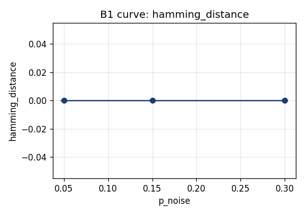

# B1 Curve Analysis

**Spec version:** B1-v1.0 + Addendum-v1.0
**Run timestamp:** 2026-04-17T18:47:58Z
**Fitter:** `ReferenceInstrumentFitter` v1.0.0
**Overall B1 verdict (per core spec):** **PASS**

---

## Curve Tables

### A_T

| p_noise | mean | std | min | max |
|---|---|---|---|---|
| 0.05 | 1.0000 | 0.0000 | 1.0000 | 1.0000 |
| 0.15 | 1.0000 | 0.0000 | 1.0000 | 1.0000 |
| 0.30 | 1.0000 | 0.0000 | 1.0000 | 1.0000 |

### R_seam

| p_noise | mean | std | min | max |
|---|---|---|---|---|
| 0.05 | 1.0000 | 0.0000 | 1.0000 | 1.0000 |
| 0.15 | 1.0000 | 0.0000 | 1.0000 | 1.0000 |
| 0.30 | 1.0000 | 0.0000 | 1.0000 | 1.0000 |

### P_seam

| p_noise | mean | std | min | max |
|---|---|---|---|---|
| 0.05 | 1.0000 | 0.0000 | 1.0000 | 1.0000 |
| 0.15 | 1.0000 | 0.0000 | 1.0000 | 1.0000 |
| 0.30 | 1.0000 | 0.0000 | 1.0000 | 1.0000 |

### F_seam

| p_noise | mean | std | min | max |
|---|---|---|---|---|
| 0.05 | 1.0000 | 0.0000 | 1.0000 | 1.0000 |
| 0.15 | 1.0000 | 0.0000 | 1.0000 | 1.0000 |
| 0.30 | 1.0000 | 0.0000 | 1.0000 | 1.0000 |

### A_rule

| p_noise | mean | std | min | max |
|---|---|---|---|---|
| 0.05 | 1.0000 | 0.0000 | 1.0000 | 1.0000 |
| 0.15 | 1.0000 | 0.0000 | 1.0000 | 1.0000 |
| 0.30 | 1.0000 | 0.0000 | 1.0000 | 1.0000 |

### rho_C0

| p_noise | mean | std | min | max |
|---|---|---|---|---|
| 0.05 | 1.0000 | 0.0000 | 1.0000 | 1.0000 |
| 0.15 | 1.0000 | 0.0000 | 1.0000 | 1.0000 |
| 0.30 | 1.0000 | 0.0000 | 1.0000 | 1.0000 |

### rho_C1

| p_noise | mean | std | min | max |
|---|---|---|---|---|
| 0.05 | 1.0000 | 0.0000 | 1.0000 | 1.0000 |
| 0.15 | 1.0000 | 0.0000 | 1.0000 | 1.0000 |
| 0.30 | 1.0000 | 0.0000 | 1.0000 | 1.0000 |

### rho_C2

| p_noise | mean | std | min | max |
|---|---|---|---|---|
| 0.05 | 1.0000 | 0.0000 | 1.0000 | 1.0000 |
| 0.15 | 1.0000 | 0.0000 | 1.0000 | 1.0000 |
| 0.30 | 1.0000 | 0.0000 | 1.0000 | 1.0000 |

### attractor_fraction

| p_noise | mean | std | min | max |
|---|---|---|---|---|
| 0.05 | 0.7300 | 0.0000 | 0.7300 | 0.7300 |
| 0.15 | 0.7300 | 0.0000 | 0.7300 | 0.7300 |
| 0.30 | 0.7300 | 0.0000 | 0.7300 | 0.7300 |

### seam_density

| p_noise | mean | std | min | max |
|---|---|---|---|---|
| 0.05 | 0.0800 | 0.0000 | 0.0800 | 0.0800 |
| 0.15 | 0.0800 | 0.0000 | 0.0800 | 0.0800 |
| 0.30 | 0.0800 | 0.0000 | 0.0800 | 0.0800 |

### seam_edges

| p_noise | mean | std | min | max |
|---|---|---|---|---|
| 0.05 | 4.0000 | 0.0000 | 4.0000 | 4.0000 |
| 0.15 | 4.0000 | 0.0000 | 4.0000 | 4.0000 |
| 0.30 | 4.0000 | 0.0000 | 4.0000 | 4.0000 |

### hamming_distance

| p_noise | mean | std | min | max |
|---|---|---|---|---|
| 0.05 | 0.0000 | 0.0000 | 0.0000 | 0.0000 |
| 0.15 | 0.0000 | 0.0000 | 0.0000 | 0.0000 |
| 0.30 | 0.0000 | 0.0000 | 0.0000 | 0.0000 |

---

## Plots

---

## Meta-Metrics (Addendum §3)

| Meta-metric | Value | Interpretation |
|---|---|---|
| Mean monotonicity | 1.000 | fraction of metrics monotone in expected direction |
| Mean smoothness   | 1.000 | slope-ratio across A_T, R_seam, rho_C0, hamming (>=0.30 acceptable) |
| Attractor persistence | 1.000 | fraction of 15 configs with h_hat = 7 |
| Ratio persistence | 1.000 | 1 - RMSD of MAX/seam ratio from true 0.75 (>=0.8 lawful) |
| Layer ordering    | 1.000 | fraction with rho_C0 >= rho_C1 >= rho_C2 |
| **CCS**           | **1.000** | **Lawful degradation** |

---

## Lawfulness Paragraph

The instrument's degradation under increasing noise scores CCS = 1.000, placing it in the **Lawful degradation** band. Mean monotonicity is 1.000 and mean smoothness across (A_T, R_seam, rho_C0, hamming) is 1.000. The attractor h = 7 is recovered in 15 of 15 configurations. The MAX/seam class ratio holds at 1.000 (true ratio 0.75; persistence = 1 - RMSD). Layer ordering rho_C0 >= rho_C1 >= rho_C2 holds in 15 of 15 configurations.

---

## Note on Independence from Pass/Fail

The curve analysis is diagnostic and does **NOT** alter the B1 pass/fail verdict. The verdict above is taken from the core spec scorer (B1-v1.0 §10).
